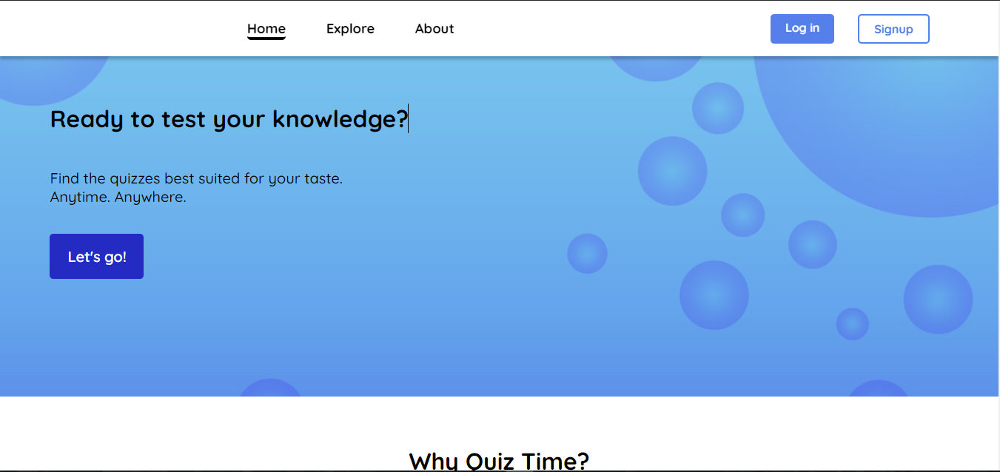
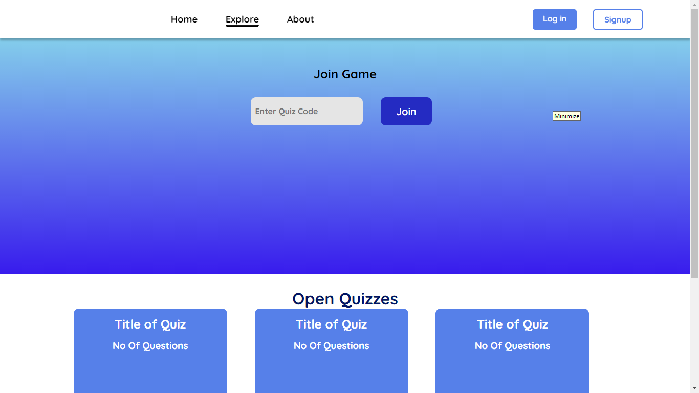
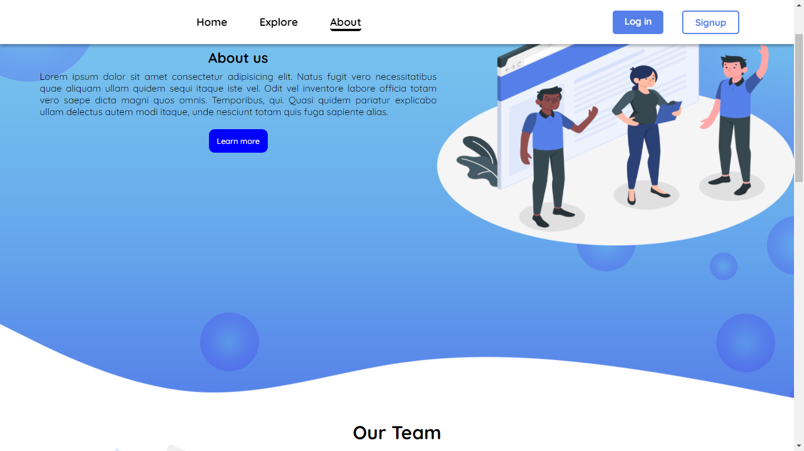
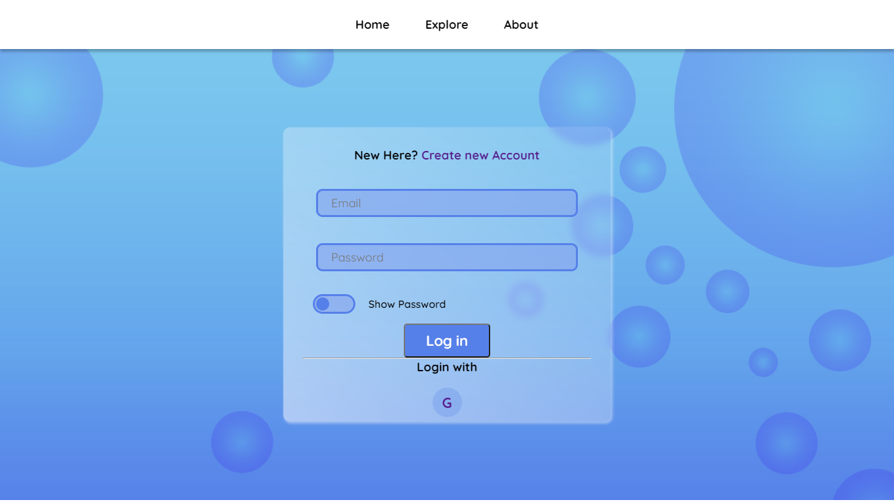
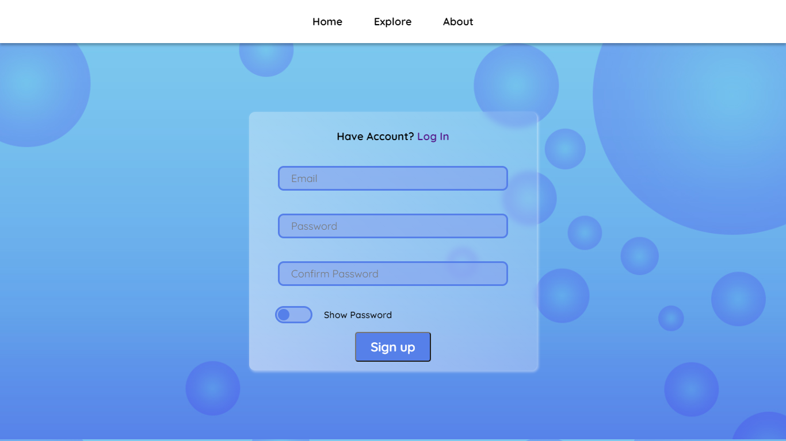
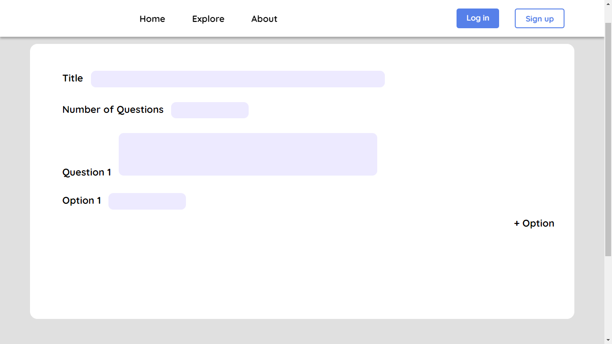
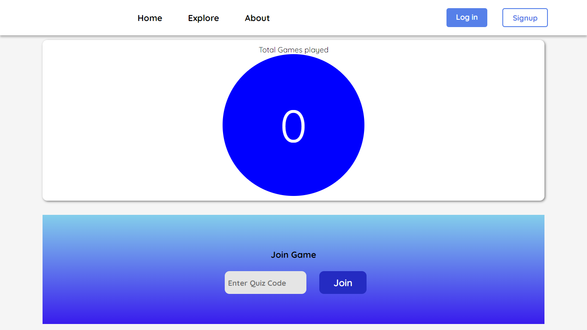

## Quiz Time 
Full Stack Project

1. Project Selected by team 3 September 2021.
2. Meeting with mentor and guide September.
3. Meeting with all group member 6 September.
4. Synopsis submission of this project 25 September 2021.
5. Project Contributors

    a) Vipin Chaudhary.

    (https://github.com/vpinchaudhary/vpinchaudhary)

    b) Sachin Sharma.

    (https://github.com/sachinsharma01/sachinsharma01)

Demo Links : 

https://vpinchaudhary.github.io/fullStackProject

https://sachinsharma01.github.io/fullStackProject

## References
1. Beta-labs (https://www.beta-labs.in/)
2. W3schools (https://www.w3schools.com/)
3. MDN (https://developer.mozilla.org/en-US/)

## Project Screenshots

## Home Page

## Explore Page

## About Page

## LogIn Page

## SignUp Page

## Create Quiz Page

## Dashboard Page

                                                            © 2021 Quiz Time Inc.